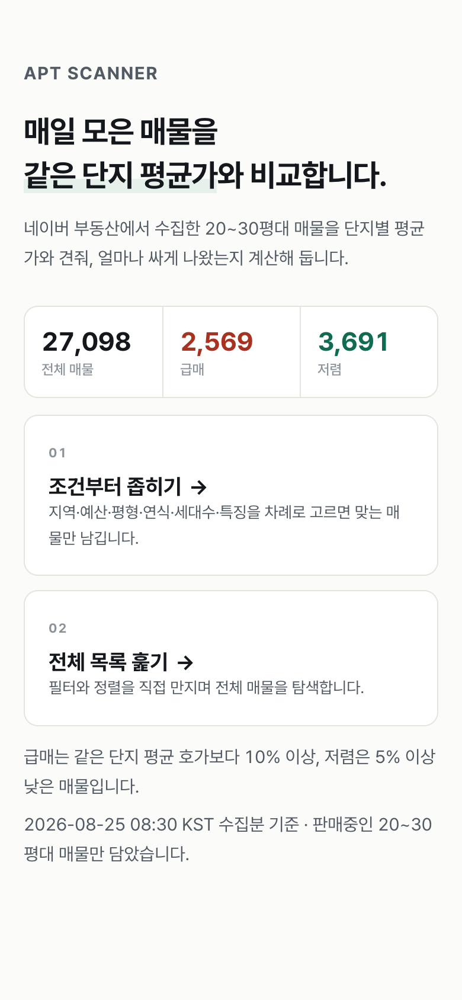
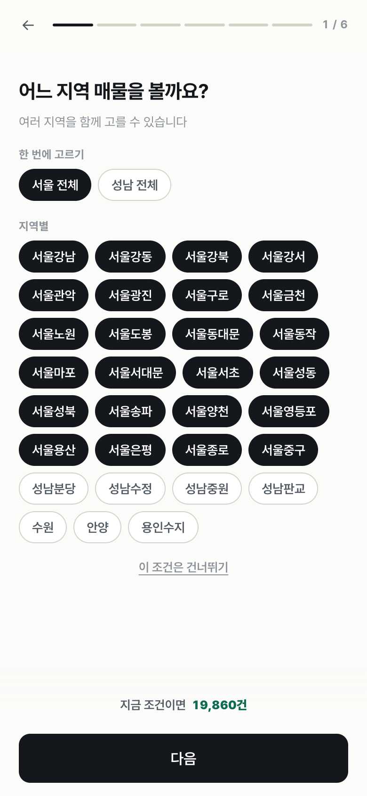
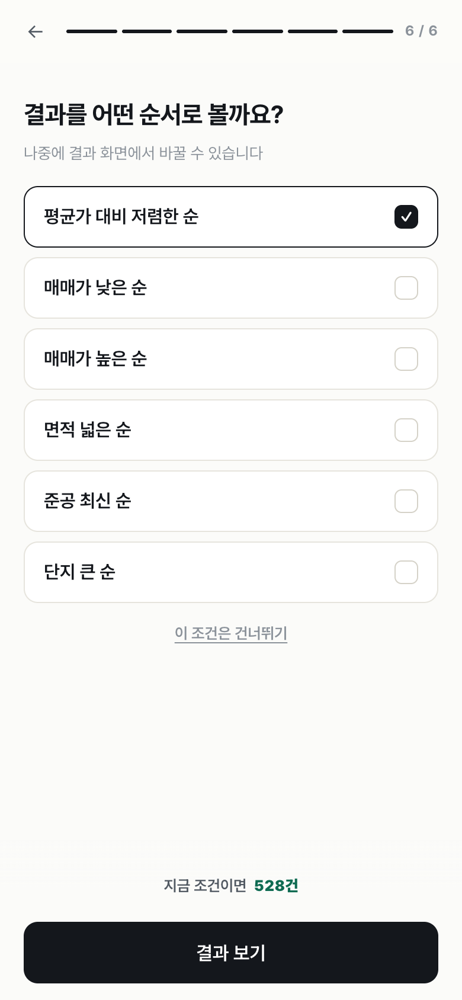
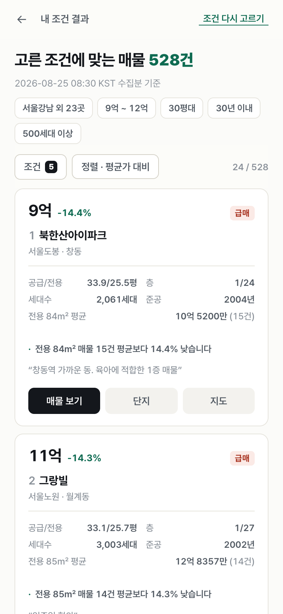
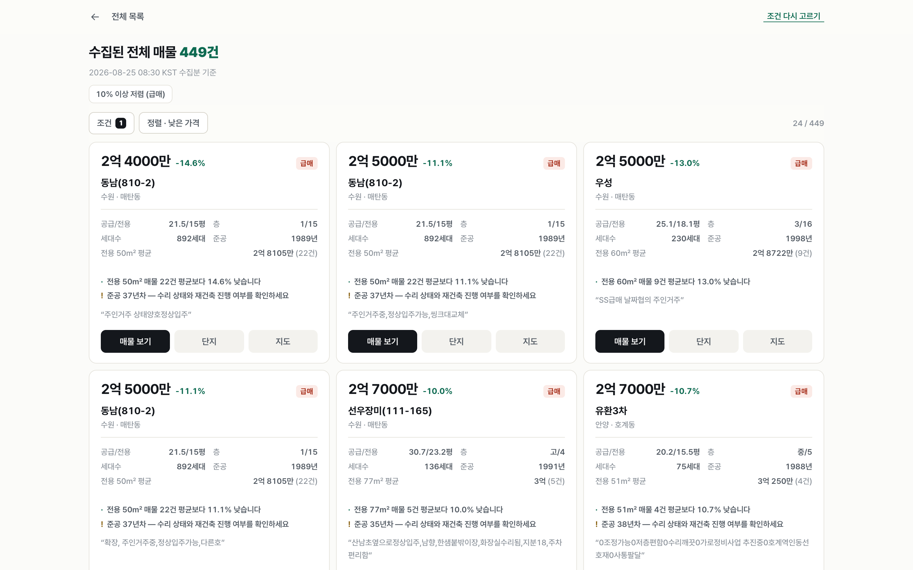
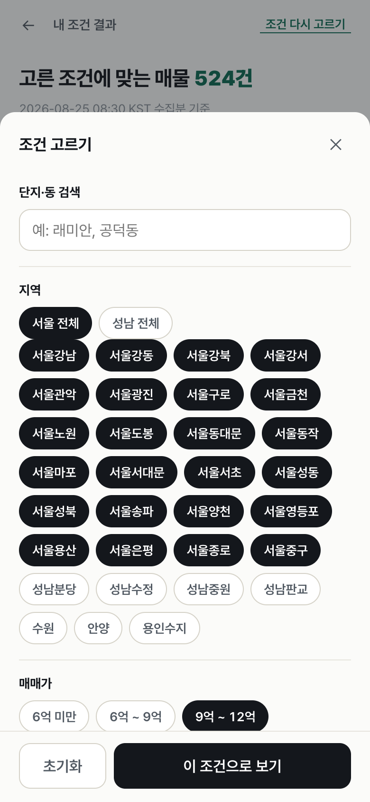
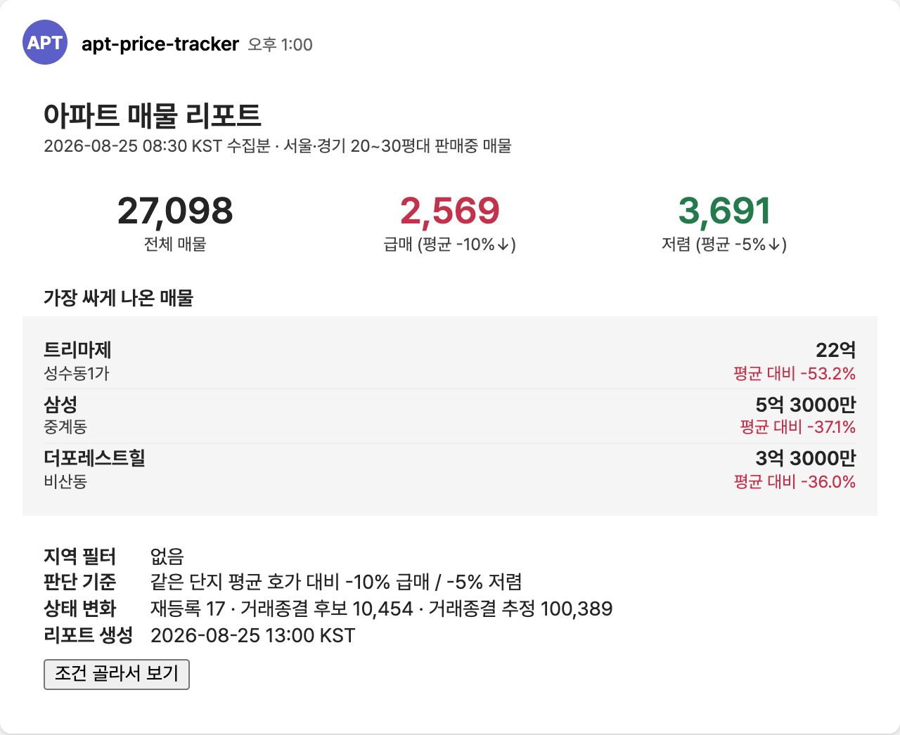

# apt-price-tracker

네이버 부동산 아파트 매물을 매일 수집해 **같은 단지 평균 호가와 비교**하고, GitHub Pages 웹 리포트와 Teams 알림으로 공유하는 배치 프로젝트입니다.

## 라이브 리포트

<https://saechimdaeki.github.io/apt-price-tracker/>

모바일 우선으로 만든 단일 페이지 앱입니다.

| 홈 | 조건 고르기 ① 지역 | 조건 고르기 ② 정렬 | 결과 목록 |
| --- | --- | --- | --- |
|  |  |  |  |
| 전체·급매·저렴 건수와 두 갈래 진입 | `서울 전체` 한 번에 선택 | 답할 때마다 매칭 건수 갱신 | 가격·평균가 대비·스펙·근거 |



넓은 화면에서는 카드가 3열로 배치됩니다. 조건은 하단 시트에서 한 번에 조정합니다.



*(스크린샷은 예시 화면입니다. 실제 매물·건수는 수집 시점에 따라 달라집니다.)*

두 갈래로 들어갑니다.

| 진입 | 설명 |
| --- | --- |
| **조건부터 좁히기** | 질문에 차례로 답하면 맞는 매물만 남습니다(지역 → 매매가 → 평형 → 연식 → 단지 규모 → 정렬). 답할 때마다 "지금 조건이면 N건"이 바로 갱신됩니다. |
| **전체 목록 훑기** | 전체 매물을 바로 열고, 조건 패널에서 원하는 필터만 골라 씁니다. |

고를 수 있는 조건은 8가지입니다.

- 단지·동 검색어
- 지역 (도시 복수 선택 / `서울 전체`·`성남 전체` 한 번에 선택)
- 매매가 (6억 미만 ~ 20억 이상 6구간)
- 평형 (20평대 / 30평대, 공급면적 기준)
- 연식 (5·10·20·30년 이내 / 30년 초과)
- 단지 규모 (300 / 500 / 1,000 / 2,000세대 이상)
- 층 (저층 / 중층 / 고층 — 전체 층수 대비 위치로 계산)
- 평균가 대비 (평균 이하 / 5% / 10% / 15% 이상 저렴)

매물 특징(역세권·올수리·대단지 등) 조건도 있지만, **현재 fin.land 수집 응답에는 태그가 들어오지 않아** 데이터에 태그가 있을 때만 화면에 나타납니다.

정렬은 평균가 대비 저렴한 순 / 매매가 낮은·높은 순 / 면적 넓은 순 / 준공 최신 순 / 단지 큰 순 6가지이고, 고른 조건은 브라우저에 저장돼 다음 방문에 그대로 복원됩니다.

화면 상단의 기준 시각은 **워크플로 실행 시각이 아니라 매물이 마지막으로 수집된 시각**(`lastSeenAt` 최댓값)입니다. 수집한 지 3일이 지나면 "이미 거래됐거나 내려간 매물이 섞여 있다"는 안내가 함께 뜹니다.

매물 카드의 링크는 세 가지입니다.

- **매물 보기** — `fin.land.naver.com/articles/{articleNo}`. 매물이 내려가면 네이버가 404 안내를 띄웁니다(주소 형식 문제가 아니라 매물 만료입니다).
- **단지** — `fin.land.naver.com/complexes/{hscpNo}`. 매물이 만료돼도 살아있어서, 해당 단지의 현재 매물을 바로 볼 수 있습니다.
- **지도** — 네이버 지도에서 `동 + 단지명` 검색.

### 리포트 화면 수정하기

UI는 `pages/index.html` **한 파일**에만 있습니다. 워크플로는 데이터(`pages/report-data.json`)와 메타(`pages/report-meta.json`)만 만들고 HTML은 건드리지 않습니다.

```bash
python3 -m http.server 4173 --directory pages
```

새 항목을 화면에 노출하려면 리포트 워크플로의 `report_rows` 딕셔너리에 필드를 추가하고, `pages/index.html`에서 읽어 쓰면 됩니다.

## 현재 수집 범위

- 총 `169개 동`
- 기준: 아파트 매매 매물, `20~39평`만 저장
- 그룹(샤드) 기준으로 실행/이어받기 가능

### 1) 수원시 (영통구, 광교, 화서) - 7개

- 수원_매탄동, 수원_영통동, 수원_망포동, 수원_이의동, 수원_하동, 수원_화서동, 수원_천천동

### 2) 용인시 수지구 - 6개

- 용인수지_풍덕천동, 용인수지_죽전동, 용인수지_동천동, 용인수지_신봉동, 용인수지_성복동, 용인수지_상현동

### 3) 서울 마용성 - 9개

- 서울마포_아현동, 서울마포_공덕동, 서울마포_상암동, 서울마포_염리동, 서울성동_옥수동, 서울성동_금호동1가, 서울성동_행당동, 서울성동_성수동1가, 서울용산_이촌동

### 4) 서울 서남권 - 8개

- 서울양천_목동, 서울양천_신정동, 서울강서_마곡동, 서울강서_내발산동, 서울강서_화곡동, 서울영등포_신길동, 서울영등포_문래동3가, 서울영등포_여의도동

### 5) 서울 남부 - 8개

- 서울동작_흑석동, 서울동작_상도동, 서울동작_사당동, 서울관악_봉천동, 서울구로_신도림동, 서울구로_구로동, 서울구로_개봉동, 서울금천_독산동

### 6) 서울 동부/서북권 - 32개

- 서울강동_고덕동, 서울강동_명일동, 서울강동_상일동, 서울광진_광장동, 서울광진_자양동, 서울동대문_용두동, 서울동대문_제기동, 서울동대문_전농동, 서울동대문_답십리동, 서울동대문_장안동, 서울동대문_청량리동, 서울동대문_회기동, 서울동대문_휘경동, 서울동대문_이문동, 서울성북_길음동, 서울성북_정릉동, 서울성북_종암동, 서울성북_하월곡동, 서울성북_상월곡동, 서울성북_장위동, 서울서대문_북아현동, 서울서대문_홍제동, 서울서대문_연희동, 서울서대문_홍은동, 서울서대문_남가좌동, 서울서대문_북가좌동, 서울종로_무악동, 서울종로_평동, 서울중구_신당동, 서울중구_중림동, 서울은평_진관동, 서울은평_응암동

### 7) 성남 전역 - 44개

- 성남수정_신흥동, 성남수정_태평동, 성남수정_수진동, 성남수정_단대동, 성남수정_산성동, 성남수정_양지동, 성남수정_복정동, 성남수정_창곡동, 성남수정_신촌동, 성남수정_오야동, 성남수정_심곡동, 성남수정_고등동, 성남수정_상적동, 성남수정_둔전동, 성남수정_시흥동, 성남수정_금토동, 성남수정_사송동, 성남중원_성남동, 성남중원_금광동, 성남중원_은행동, 성남중원_상대원동, 성남중원_여수동, 성남중원_도촌동, 성남중원_갈현동, 성남중원_하대원동, 성남중원_중앙동, 성남분당_분당동, 성남분당_수내동, 성남분당_정자동, 성남분당_율동, 성남분당_서현동, 성남분당_이매동, 성남분당_야탑동, 성남판교_판교동, 성남판교_삼평동, 성남판교_백현동, 성남분당_금곡동, 성남분당_궁내동, 성남분당_동원동, 성남분당_구미동, 성남판교_운중동, 성남판교_대장동, 성남판교_석운동, 성남판교_하산운동

### 8) 안양권 - 5개

- 안양_안양동, 안양_비산동, 안양_관양동, 안양_평촌동, 안양_호계동

### 9) 서울 강남3구 - 37개

- 서울강남_역삼동, 서울강남_개포동, 서울강남_청담동, 서울강남_삼성동, 서울강남_대치동, 서울강남_신사동, 서울강남_논현동, 서울강남_압구정동, 서울강남_세곡동, 서울강남_자곡동, 서울강남_율현동, 서울강남_일원동, 서울강남_수서동, 서울강남_도곡동, 서울서초_방배동, 서울서초_양재동, 서울서초_우면동, 서울서초_원지동, 서울서초_잠원동, 서울서초_반포동, 서울서초_서초동, 서울서초_내곡동, 서울서초_염곡동, 서울서초_신원동, 서울송파_잠실동, 서울송파_신천동, 서울송파_풍납동, 서울송파_송파동, 서울송파_석촌동, 서울송파_삼전동, 서울송파_가락동, 서울송파_문정동, 서울송파_장지동, 서울송파_방이동, 서울송파_오금동, 서울송파_거여동, 서울송파_마천동

### 10) 서울 노도강 - 13개

- 서울노원_월계동, 서울노원_공릉동, 서울노원_하계동, 서울노원_상계동, 서울노원_중계동, 서울도봉_쌍문동, 서울도봉_방학동, 서울도봉_창동, 서울도봉_도봉동, 서울강북_미아동, 서울강북_번동, 서울강북_수유동, 서울강북_우이동

## 최근 변경된 실행 로직

- 샤드별 수집/저장 지원
  - `bot.safe.region-shard=1..10`이면 샤드별 파일 사용
  - `data/apt-listings-s{N}.json`
  - `data/run-progress-s{N}.json`
  - `0`이면 기존 통합 파일(`data/apt-listings.json`, `data/run-progress.json`)
- 차단(abuse) 감지 시 조기 종료 + 진행 오프셋 저장
  - 다음 실행에서 같은 샤드의 `run-progress`를 읽어 이어서 실행
- 수동 실행에서 오프셋 의미 정리
  - `start_region_offset`을 비우면: 저장된 진행 오프셋 자동 이어받기
  - `start_region_offset=0`: 해당 그룹 처음부터 재시작
  - `max_regions_per_run=0` + `start_region_offset>0`: 래핑 없이 오프셋부터 그룹 끝까지만 실행
- 리포트 워크플로우는 샤드 JSON 자동 병합
  - `data/apt-listings-s*.json` 우선 사용
  - 없으면 `data/apt-listings.json` 사용
- 기존 통합 파일을 샤드 파일로 1회 변환 가능
  - `python3 scripts/split_listings_by_shard.py --input data/apt-listings.json --output-dir data`
  - 수집 워크플로우를 다시 돌리지 않아도 리포트 워크플로우만 실행 가능

## 워크플로우

### 1) 수집 워크플로우

- 파일: `.github/workflows/apt-price-bot.yml`
- 스케줄:
  - KST 08:30 (평일)
  - KST 13:30 (평일)
- 스케줄 실행 시 샤드 `1~10` 병렬 실행(matrix)
- 수동 실행 시 지역 그룹을 사람이 읽기 쉬운 라벨로 선택 가능
- 변경된 `data/apt-listings*.json`, `data/run-progress*.json` 자동 커밋

수동 실행 입력값:

- `region_scope`: 실행할 지역 그룹
- `max_regions_per_run`: 이번 실행 최대 동 수 (`0`이면 전체, 단 `offset>0`이면 그룹 끝까지만)
- `start_region_offset`: 시작 오프셋 (비우면 자동 이어받기)
- `max_complex_pages_on_overflow`: 매물량 많은 단지 확장 페이지 상한
- `max_complexes_per_region`: 지역별 최대 단지 수 (`0`이면 제한 없음)
- `commit_data`: 데이터 자동 커밋 여부

### 2) 리포트/알림 워크플로우

- 파일: `.github/workflows/send-teams-from-json.yml`
- 스케줄: KST 13:00 (평일)
- 샤드 데이터 병합 후 `pages/report-data.json`(매물 배열) + `pages/report-meta.json`(기준 시각·건수·임계값) 생성
- `pages/` 전체를 GitHub Pages로 배포 (화면은 레포에 커밋된 `pages/index.html`이 그대로 쓰임)
- Teams 웹훅이 설정되어 있으면 요약 카드 1회 전송



카드는 웹 리포트와 같은 기준(수집 시각, 급매/저렴 정의)으로 맞춰져 있고, 가장 싸게 나온 매물 3건을 단지 중복 없이 보여줍니다. 각 행을 누르면 해당 매물로, 버튼을 누르면 웹 리포트로 이동합니다.

`report-meta.json` 필드:

| 키 | 의미 |
| --- | --- |
| `dataAt` / `dataLabel` | 매물이 마지막으로 수집된 시각 (화면 기준 시각) |
| `runLabel` | 워크플로 실행 시각 |
| `total`, `bargainCount`, `cheapCount` | 전체·급매·저렴 건수 |
| `relistedCount`, `offMarketCandidateCount`, `offMarketCount` | 상태별 건수 |
| `bargainThresholdPct`, `cheapThresholdPct` | 급매(-10%)·저렴(-5%) 판정 임계값 |

## 매물 상태 규칙

- 상태:
  - `ACTIVE` (판매중)
  - `OFF_MARKET_CANDIDATE` (거래종결 후보)
  - `OFF_MARKET` (거래종결 추정)
  - `RELISTED` (다시 등록된 매물)
- 이번 실행에서 수집 성공한 지역 기준으로 상태 전환
- 수집 실패/차단 지역은 해당 회차 상태 전환 대상에서 제외

## 주요 설정값

- 파일: `src/main/resources/application.yml`

`bot.safe.*`:

- `max-regions-per-run`: 실행당 최대 동 수 (`0` 전체)
- `start-region-offset`: 시작 오프셋
- `region-shard`: `0`(전체) 또는 `1~10`(그룹 실행)
- `stop-run-on-abuse`: 차단 시 실행 중단
- `save-run-progress`: 진행 오프셋 저장
- `region-delay-min-ms`, `region-delay-max-ms`: 지역 간 딜레이

`naver.safe.*`:

- `max-complex-pages`: 기본 페이지 상한
- `max-complex-pages-on-overflow`: 매물량 많은 단지 확장 페이지 상한
- `max-complexes-per-region`: 지역당 단지 상한
- `complex-delay-*`, `batch-cooldown-*`, `overflow-batch-cooldown-*`: 요청/배치 딜레이
- `request-timeout-ms`: 요청 타임아웃
- `abuse-cooldown-minutes`: abuse 감지 후 쿨다운(현재 기본 5분)

## 로컬 실행

```bash
./gradlew clean bootRun
```

컴파일 체크:

```bash
./gradlew --no-daemon compileKotlin
```

테스트:

```bash
./gradlew test
```

## 필요한 설정

### GitHub Secrets

- `TEAMS_WEBHOOK_URL`: Teams Webhook URL (없으면 알림 스킵, JSON/리포트는 생성)

### GitHub Pages

- Repository Settings -> Pages -> Source: **GitHub Actions**

## Runner

현재 워크플로우 러너:

```yaml
runs-on: [self-hosted, macOS, ARM64]
```
